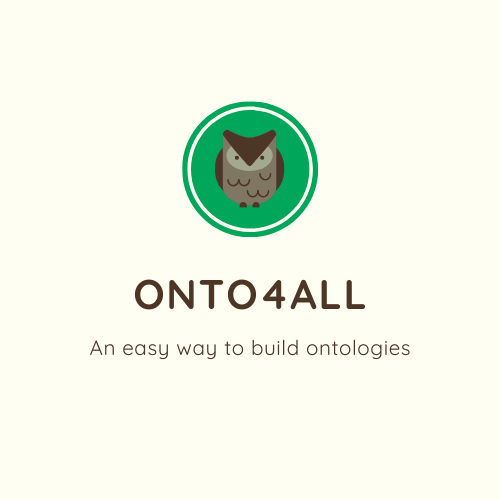

<p align="center">
 
 </p>
 <h3 align="center">
 OntoForALL é um editor gráfico com a capacidade de criar, editar e exportar ontologias para XML, OWL, SVG. Disponível em:
 <a href="https://onto4alleditor.com/">https://onto4alleditor.com/</a>
 </h3>
 
 


 
## Documentação 
* Ferramenta 1: Laravel 6.x+ / https://laravel.com/docs/6.x
* Ferramenta 2: AdminLTE / https://adminlte.io/themes/AdminLTE/pages/UI/general.html
* Ferramenta 3: mxGraph / https://jgraph.github.io/mxgraph/ 

### Guia de instalaçao 
#### Pré-requisitos 
* PHP: * Versão >= 7.1.3
* OpenSSL PHP Extension 
* PDO PHP Extension 
* Mbstring PHP Extension 
* Tokenizer PHP Extension 
* XML PHP Extension 
* Ctype PHP Extension 
* JSON PHP Extension + Banco de dados (MySQL, SQLite) + Servidor web (Apache)
* Composer. 
* Docker Desktop 

##### Passo a passo 

1. Clone o repositório para seu computador; 

2. Execute o Docker Desktop;

3. Na pasta principal do projeto, copie o arquivo de ambiente:

```bash
cp .env.example .env
```

4. Revise o `.env` e mantenha estes valores para o ambiente Docker:

```env
APP_URL=http://localhost:8000
DB_CONNECTION=mysql
DB_HOST=database
DB_PORT=3306
DB_DATABASE=onto4all
DB_USERNAME=onto4all
DB_PASSWORD=secret
```

5. Suba a aplicaçao com Docker Compose:

```bash
docker compose up --build
```

6. Verifique se os containers `app` e `database` iniciaram corretamente.

7. A aplicaçao ficará disponível em `http://localhost:8000`.

8. O bootstrap do container executa automaticamente:

- `composer install`
- `php artisan key:generate`
- `php artisan migrate`
- `php artisan db:seed` na primeira inicialização de um banco vazio
- correção de permissões em `storage/` e `bootstrap/cache/` para o Apache gravar logs e cache

9. Login padrão após o seed inicial:

```text
email: admin@admin.com.br
senha: 123456
```

10. Para derrubar o ambiente:

```bash
docker compose down
```

11. Para remover também o volume do banco e recriar tudo do zero:

```bash
docker compose down -v
```

12. Se aparecer erro de permissão em `storage/logs/laravel.log` ou `bootstrap/cache`, não use `sudo docker compose`.
O container já corrige essas permissões no boot; reinicie o serviço `app` para reaplicar o ajuste.

#### Desenvolvimento 

* OntoForAll usa a biblioteca de Javascript mxGraph como componente principal para diagramação das ontologias, com o GraphEditor Example como base para tudo. O restante do projeto foi desenvolvido utilizando Laravel. O frontend foi feito utilizando o template AdminLTE2 como base.


#### Desenvolvido por Lucas Piazzi de Castro ####
